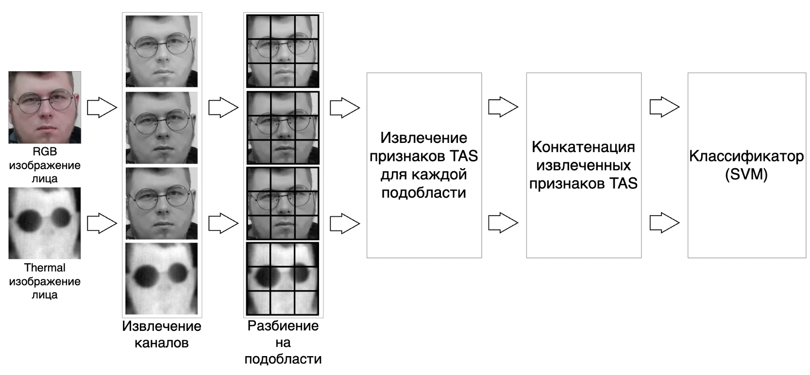
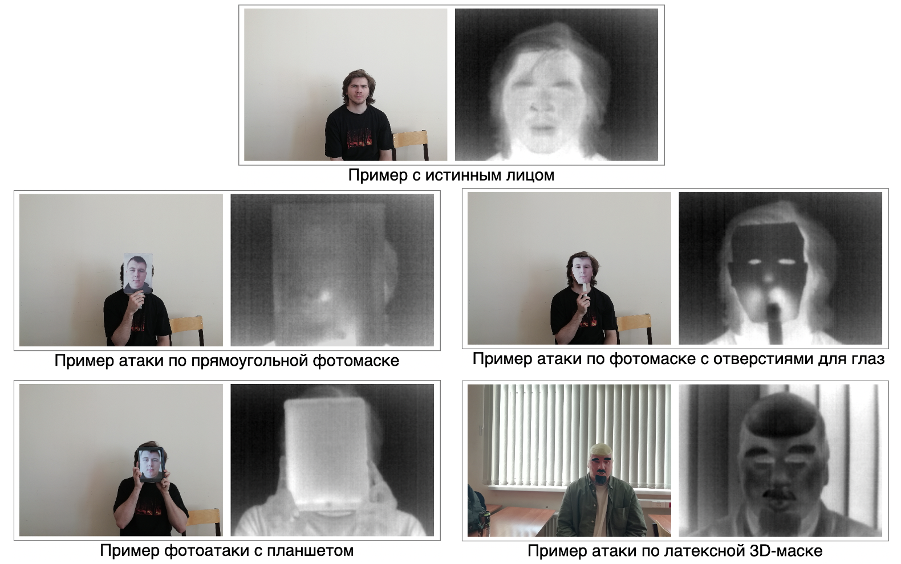

# face-antispoofing

В данном репозитории представлен код моей дипломной работы, в ходе которой был разработан и реализован новый эффективный алгоритм обнаружения [презентационных атак на системы распознавания лиц](https://arxiv.org/abs/2111.11794).

## Разработанный алгоритм MC-TAS-SVM
В разработанном алгоритме для обнаружения спуфинга предлагается использовать текстурные признаки ["Статистики пороговой смежности" (от англ. Threshold Adjacency Statistics, TAS)](https://bmcbioinformatics.biomedcentral.com/articles/10.1186/1471-2105-8-110) и классификатор SVM с линейным ядром. Схема разработанного и реализованного алгоритма MC-TAS-SVM (MultiChannel-TAS-SVM) представлена на рисунке ниже.

Также для сравнения были реализованы два других эффективных алгоритма: [RDWT-Haralick-SVM](https://www.researchgate.net/publication/311897496_Face_anti-spoofing_using_Haralick_features) и [LBP-SVM](https://www.researchgate.net/publication/230775873_On_the_Effectiveness_of_Local_Binary_Patterns_in_Face_Anti-spoofing).

Код с реализацией алгоритмов и их модификаций представлен в ноутбуке [notebooks/implementation_of_algorithms.ipynb](https://github.com/arturburiev/face-antispoofing/blob/master/notebooks/implementation_of_algorithms.ipynb).

## Собранный набор данных
Для обучения и оценки производительности реализованных алгоритмов был собран и подготовлен набор данных. Собранный набор данных состоит из 611 образцов (пар изображений). Из них 257 образцов – примеры с истинными лицами, и 354 образца являются примерами спуфинг-атак. Изображения были получены для видимого и тепловизионного спектров. Для получения фотографий в видимом спектре использовалась RGB-камера смартфона Honor 9 Lite Midnight Black (LLD-L31), снимающая с разрешением 4160 x 3120, а для получения полутоновых изображений в тепловом спектре использовалась тепловизионная камера Seek Thermal Compact XR, разрешение которой составляет 960 x 1280. Примеры презентационных атак и и пример с истинным лицом из собранного датасета представлены на рисунке ниже.

## Результаты
Разработанный алгоритм алгоритм показал себя более эффективным по сравнению с другими реализованными алгоритмами и позволил добиться максимального качества: значение метрики AUC ROC – 1.0, значение метрики HTER – 0.0.
